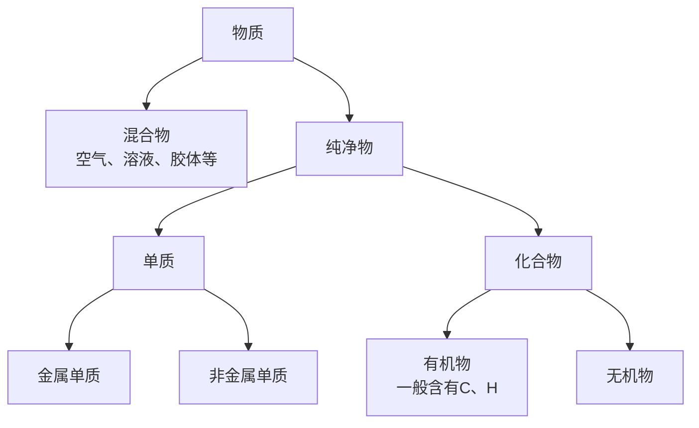
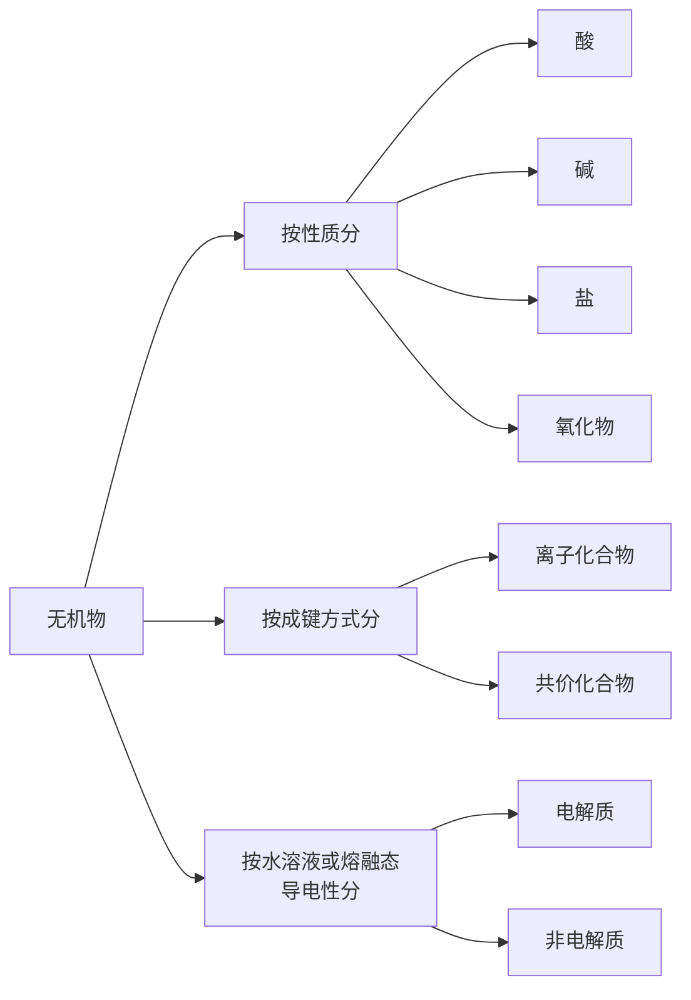

# 物质的分类

对物质进行分类研究可以帮助理解、避免遗漏。

## 1.分类方法

### 1.1. 树状分类法

**定义：** 对同类事物进行再分类的方法。

**特点**：包含并列关系。

### 1.2. 交叉分类法

**定义**：对同一物质从不同角度分类的方法。

**特点**：并列、交叉关系。

???+ tip "同素异构体"

    同素：同种元素；异构：不同结构；体：**单质**。

    - 同素异构体转化时化学变化（如$\ce{O_2}$与$\ce{O_3}$）
    - 同种元素组成的物质不一定是纯净物（如$\ce{O_2}$与$\ce{O_3}$）
    - $\ce{H_2}$、$\ce{D_2}$是同种物质。$\ce{^{18}O2}$、$\ce{^{16}O2}$是同种物质。

???+ tip "结晶水合物是纯净物"

    - 胆矾（蓝矾）：$\ce{CuSO4 . 5H2O}$
    - 明矾：$\ce{KAl(SO4)2 . 12H2O}$
    - 绿矾：$\ce{FeSO4 . 7H2O}$