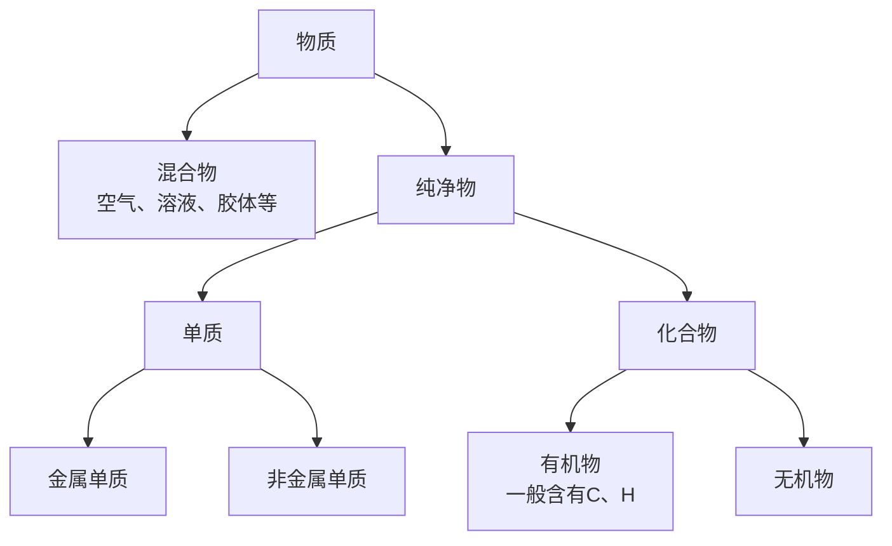
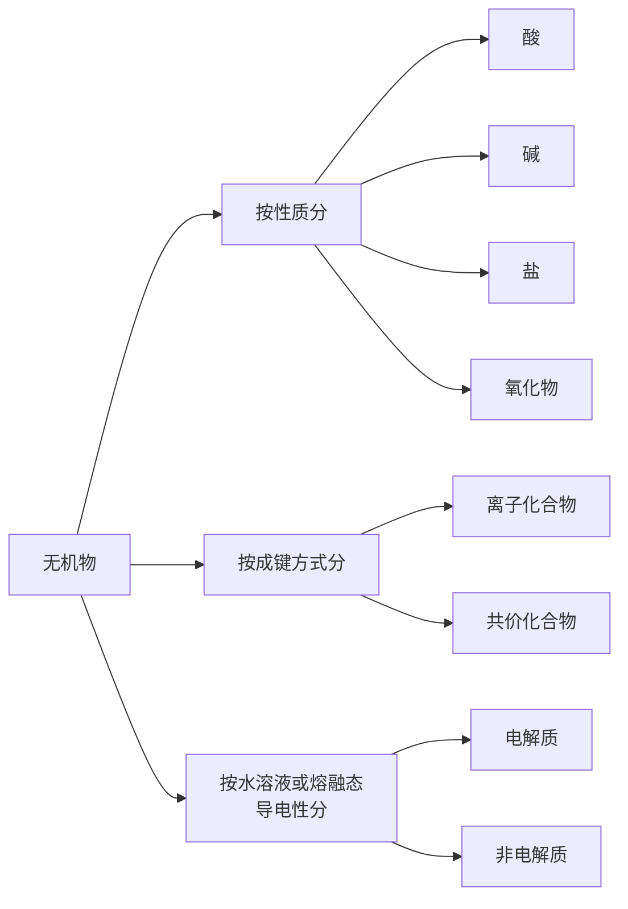

# 物质的分类

对物质进行分类研究可以帮助理解、避免遗漏。

## 1.分类方法

### 1.1. 树状分类法

**定义：** 对同类事物进行再分类的方法。

**特点**：包含并列关系。

???+ tip "同素异构体"

    同素：同种元素；异构：不同结构；体：**单质**。

    - 同素异构体转化时化学变化（如$\ce{O_2}$与$\ce{O_3}$）
    - 同种元素组成的物质不一定是纯净物（如$\ce{O_2}$与$\ce{O_3}$）
    - $\ce{H_2}$、$\ce{D_2}$是同种物质。$\ce{^{18}O2}$、$\ce{^{16}O2}$是同种物质。

???+ tip "结晶水合物是纯净物"

    - 胆矾（蓝矾）：$\ce{CuSO4 . 5H2O}$
    - 明矾：$\ce{KAl(SO4)2 . 12H2O}$
    - 绿矾：$\ce{FeSO4 . 7H2O}$

### 1.2. 交叉分类法

**定义**：对同一物质从不同角度分类的方法。

**特点**：并列、交叉关系。

## 2. 再认识酸碱盐以及氧化物

### 2.1. 酸

**定义**：电力的阳离子全部都是$\ce{H+}$的化合物。

#### 2.1.1. 酸的分类

!!! warning inline end "注意"
    - 不是几个氢原子就是几元酸，如$\ce{CH3OOH}、\ce{H3BO3}$是一元酸。
    - 用与$\ce{NaOH}$反应的比例或与活泼金属反应的量证明是几元酸。

1. **是否完全电离**

    - 强酸：“六大强酸”：$\ce{H2SO4}、\ce{HNO3}、\ce{HCl}、\ce{HBr}、\ce{HI}、\ce{HClO4}$。
    - 弱酸：剩下的

2. **电离出的****$\ce{H^+}$****个数**

    - 一元酸：如$\ce{HCl}$
    - 二元酸：如$\ce{H2SO4}$
    - 多元酸：如$\ce{H3PO4}$

3. **氧化还原性**

    - 氧化性酸：$\ce{浓H2SO4}、\ce{HNO3}$ 等
    - 非氧化性酸：$\ce{HCl}$、$\ce{稀H2SO4}$、$\ce{CH3OOH}$ 等
    - 还原性酸：$\ce{HI}、\ce{H2S}$ 等

4. **是否含有氧元素**

    - 含氧酸
    - 无氧酸

5. **沸点**

    - 挥发性酸：$\ce{HCl}$、$\ce{HNO3}$
    - 非挥发性（高沸点）酸：$\ce{H2SO4}、\ce{H3PO4}$

#### 2.1.2. 酸的通性

1. 与碱中和

    $$
    \ce{HCl + NaOH = NaCl + H2O}
    $$

2. 与活泼金属反应生成$\ce{H2}$

    $$
    \ce{Zn + H2SO4 = ZnSO4 + H2 ^}
    $$

3. 与某些盐复分解（生成水淀气）

    $$
    \ce{CaCO3 + 2HCl = CaCl2 + H2O + CO2 ^}
    $$

4. 与金属氧化物反应

    $$
    \ce{Fe2O3 + 3H2SO4 = Fe2(SO4)3 + 3H2O}
    $$

5. 与指示剂作用

### 2.2. 碱

**定义**：电离的阴离子全部都是$\ce{OH-}$

#### 2.2.1. 分类

1. **是否完全电离**

    - 强碱：$\ce{KHO}、\ce{NaOH}、\ce{Ba(OH)2}、\ce{Ca(OH)2}$ 等
    - 弱碱：大多数难溶碱和$\ce{NH3.H2O}$

2. **电离出的****$\ce{OH-}$****个数**

    - 一元碱：$\ce{KOH}、\ce{NaOH}$ 等
    - 二元碱：$\ce{Ba(OH)2}、\ce{Ca(OH)2}$ 等
    - 多元碱：$\ce{Fe(OH)3}、\ce{Cr(OH)3}$ 等

3. **是否可溶**

    - 可溶碱：强碱和$\ce{NH3.H2O}$
    - 非可溶碱：其他大多数

#### 2.2.2. 碱的通性

1. 与酸中和

    $$
    \ce{Ba(OH)2 + 2HNO3 = 2H2O + Ba(NO3)2}
    $$
2. 与非金属氧化物反应

    $$
    \ce{Ba(OH)2 + SO2 = H2O + BaSO3}
    $$
3. 与某些盐反应（反应物一般可溶）

    $$
    \ce{Ba(OH)2 + Na2CO3 = BaCO3 v + 2NaOH}
    $$
4. 与指示剂作用

### 2.3. 盐

**定义**：阳离子含有金属阳离子，阴离子含有酸根阴离子

#### 2.3.1. **分类**

!!! tip inline end "一般规律"
    - 钾钠铵硝均可容
    - 硫酸不溶钡与铅
    - 卤化物不容银亚汞
    - 其他盐大多难容
    - 酸式盐、醋酸盐大多可溶

1. 方式1

    - 正盐（阳离子没有$\ce{H+}$，阴离子没有$\ce{OH-}$）：$\ce{Na2CO3}、\ce{KCl}$
    - 酸式盐（阳离子含有$\ce{H+}$，只有二元酸以上才有）：$\ce{NaHCO3}、\ce{NaHSO4}、\ce{NaH2PO4}$
    - 碱式盐（阴离子含$\ce{OH-}$）：$\ce{Cu2(OH)2CO3}$（铜绿，孔雀石）
    - 复盐（阳离子为两种及以上的金属阳离子）：$\ce{KAl(SO4)2}、\ce{(NH4)2Fe(SO4)2}$
  
2. 方式2

    - 可溶盐
    - 难容盐

### 2.4. 氧化物

#### 2.4.1 分类

1. 按组成元素分
   - 金属氧化物
   - 非金属氧化物
2. 按性质分
   - **酸性氧化物**：与 $OH^-$ 反应只生成盐和水。  
     如 $CO_2$、$SO_2$、$SO_3$。
   - **碱性氧化物**：与 $H^+$ 反应只生成一种盐和水。  
     如 $CaO$
   - **两性氧化物**：与 $H^+$、$OH^-$ 均可反应。  
     如 $Al_2O_3$。
   - **不成盐氧化物**：与 $H^+$、$OH^-$ 均不反应。  
     如 $CO$、$NO$。

!!! warning "不是能与水反应就是酸性或碱性氧化物"
    - $2NO_2 + 2NaOH = NaNO_3 + NaNO_2 + H_2O$  
      $NO_2$ 不是酸性氧化物，因为它与碱反应生成了两种盐。
    - $Na_2O_2 + 4HCl = 4NaCl + 2H_2O + O_2 \uparrow$  
      $Na_2O_2$ 不是碱性氧化物，因为它与酸反应除了生成盐和水外，还生成了氧气。

!!! tip "氧化物对应碱或酸价态一致"
    **酸**  
    *   $CO_2 \rightarrow H_2CO_3$; $SO_2 \rightarrow H_2SO_3$
    *   $SO_3 \rightarrow H_2SO_4$; $SiO_2 \rightarrow H_2SiO_3$ (价态一致)
    *   $N_2O_5 \rightarrow HNO_3$; $N_2O_3 \rightarrow HNO_2$
    *   $NO_2 \rightarrow \times$ ; $Mn_2O_7 \rightarrow HMnO_4$
    **碱**
    *   $K_2O \rightarrow KOH$
    *   $FeO \rightarrow Fe(OH)_2$
    *   $Fe_2O_3 \rightarrow Fe(OH)_3$
    *   $Fe_3O_4 \rightarrow \times$

#### 2.4.2 酸性氧化物通性

1.   **与碱反应**
2.   **与碱性氧化物反应**
    *   $SO_3 + CaO = CaSO_4$
3.   **与某些盐反应**
    *   $SO_2 + Na_2CO_3 = Na_2SO_3 + CO_2 \uparrow$ (强制弱)
4.   **与 $H_2O$ 反应 (不一定)**
    *   $H_2O + CO_2 = H_2CO_3$ $\checkmark$
    *   $SiO_2 + H_2O = \times$
    *   **一般地，若酸可溶，对应氧化物可与 $H_2O$ 反应。**
    *   $N_2O_5 + H_2O = 2HNO_3$
    *   $P_2O_5 + 3H_2O = 2H_3PO_4$